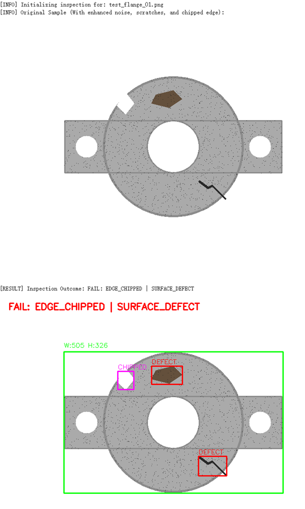

# Industrial Flange Defect Detection using OpenCV

## Description

OpenCV-based machine vision inspection system for detecting surface defects on a synthetic industrial flange part.

This project demonstrates a basic computer vision inspection pipeline. It generates a synthetic flange image with simulated manufacturing defects, including rust stains, scratches, chipped edges, and random surface noise. The system then applies image preprocessing, contour detection, dimension checking, and HSV-based color masking to identify surface defects and generate a final inspection result.

## Features

- Generates a synthetic industrial flange sample
- Simulates rust stains, deep scratches, chipped edges, and random noise
- Performs dimensional and edge inspection using contour detection
- Detects surface defects using HSV color masking
- Draws bounding boxes around detected defects
- Produces a final PASS / FAIL inspection result

## Technologies Used

- Python
- OpenCV
- NumPy
- Google Colab / Jupyter Notebook
- Image processing
- Contour detection
- HSV color masking

## Project Structure

```text
Industrial-Flange-Defect-Detection-using-OpenCV/
├── Industrial_Flange.ipynb
├── README.md
└── result.png
```

## How to Run

1. Open `Industrial_Flange.ipynb`.
2. Run all cells in Google Colab or Jupyter Notebook.
3. The notebook will generate a synthetic flange image and perform defect inspection.
4. The final result will display detected defects with bounding boxes.

## Sample Output

The inspection system detects surface defects on the generated industrial flange image.




## Methodology

1. Generate a synthetic industrial flange image using OpenCV drawing functions.
2. Add simulated defects such as rust stains, scratches, chipped edges, and random dark noise.
3. Convert the image to grayscale and apply Gaussian blur for preprocessing.
4. Use Canny edge detection and contour detection for dimension checking.
5. Convert the image to HSV color space.
6. Apply color thresholding to detect dark surface defects.
7. Draw red bounding boxes around detected defect areas.
8. Output the final inspection result as `PASS` or `FAIL`.

## Result Interpretation

- Green bounding box: detected part boundary and dimension check
- Red bounding boxes: detected surface defects
- `PASS`: no major defects detected
- `FAIL: SURFACE_DEFECT`: one or more surface defects detected
- `DIMENSION_FAIL`: part dimensions are outside the expected tolerance range

## Limitations

This project uses synthetic images rather than real factory camera images. The threshold values are manually selected and may need adjustment for real-world lighting conditions, camera settings, material differences, and production environments.

## Future Improvements

- Test with real industrial inspection images
- Improve defect classification for rust, scratches, and chipped edges
- Add automatic threshold tuning
- Export inspection results to CSV or JSON
- Build a simple user interface for uploading part images

